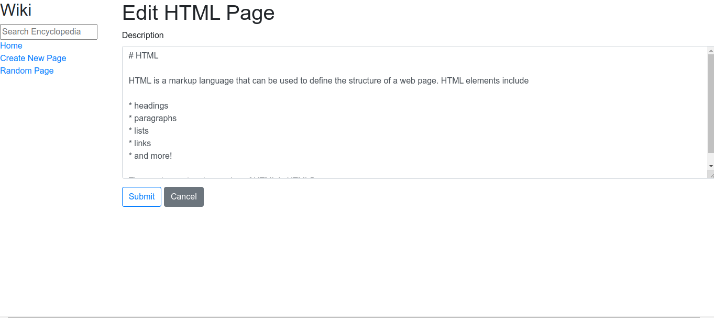

# CS50 Wiki project

## Features (create, update)
### All pages


### Single page


### Edit page


### Add new pages


### Run The App

#### 1

``` 
git clone https://github.com/medaminefh/wiki.git
```

### 2

```
pip3 install -r requirements. txt
```

### 3 

```
python3 manage.py runserver
```

